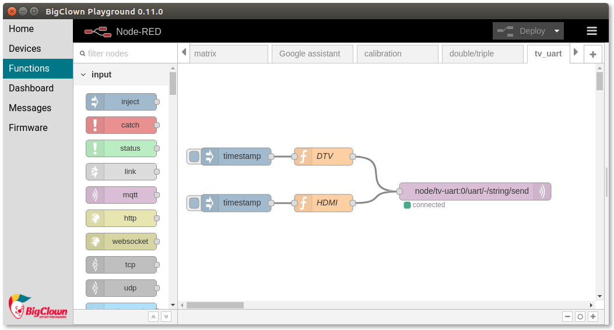
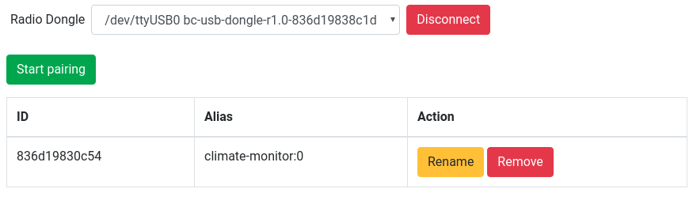
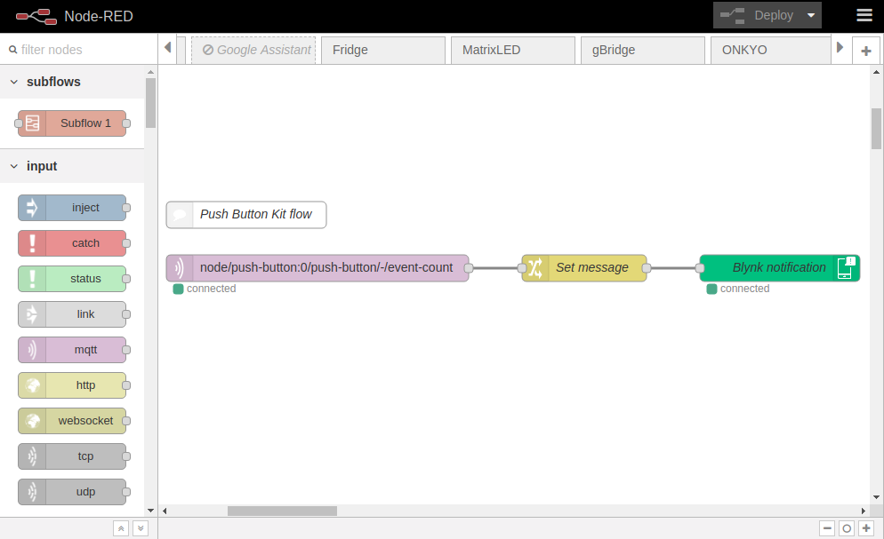
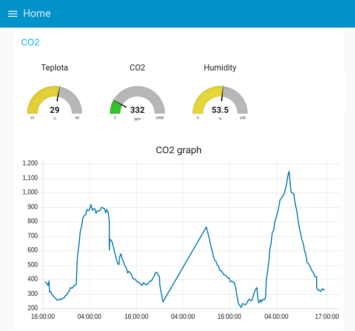
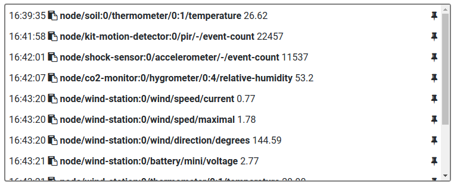
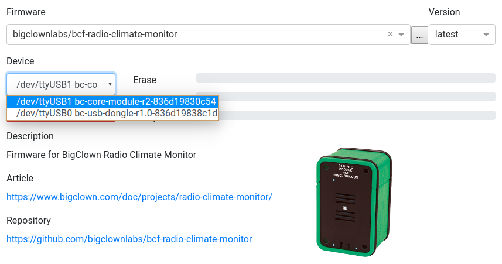

# HARDWARIO Playground

HARDWARIO Playground is free **Windows**, **macOS** and **Linux** software that enables you to:

* **Flash firmware** to Core Module
* **Manage wireless network** with Radio Dongle and nodes
* **Create programs** with visual programming in the Node-RED
* **Visualize** measured values and control nodes with Dashboard

## Download HARDWARIO Playground



* 64-bit:
  * [installable](https://github.com/bigclownlabs/bch-playground/releases/download/v1.1.0/bigclown-playground-1.1.0-win-setup-64bit.exe)
  * [portable](https://github.com/bigclownlabs/bch-playground/releases/download/v1.1.0/bigclown-playground-1.1.0-windows-64bit.exe)
* 32-bit:
  * [installable](https://github.com/bigclownlabs/bch-playground/releases/download/v1.1.0/bigclown-playground-1.1.0-win-setup-32bit.exe)
  * [portable](https://github.com/bigclownlabs/bch-playground/releases/download/v1.1.0/bigclown-playground-1.1.0-windows-32bit.exe)



* [DMG](https://github.com/bigclownlabs/bch-playground/releases/download/v1.1.0/bigclown-playground-1.1.0-macos.dmg)



* AppImage:
  * [x86\x64](https://github.com/bigclownlabs/bch-playground/releases/download/v1.1.0/bigclown-playground-1.1.0-linux-x86_64.AppImage)
* DEB:
  * [amd64](https://github.com/bigclownlabs/bch-playground/releases/download/v1.1.0/bigclown-playground-1.1.0-linux-amd64.deb)
  * [i386](https://github.com/bigclownlabs/bch-playground/releases/download/v1.1.0/bigclown-playground-1.1.0-linux-i386.deb)
  * [x64](https://github.com/bigclownlabs/bch-playground/releases/download/v1.1.0/bigclown-playground-1.1.0-linux-x64.tar.gz)



## Videotutorials

If you like videotutorials, you can watch quick guide to the HARDWARIO Playground in 5 videos. They explain flashing, pairing, Dasboard, Node-RED and Blynk phone integration.



## Using HARDWARIO Playground

### Home

Home will display Quick Start tutorial webpage.

### Devices

On this tab you connect to the Radio Dongle. Choose the Radio Dongle \(`bc-usb-dongle`\) from the list and click Connect

Please see the [Troubleshooting](bigclown-playground.md#troubleshooting) section if you cannot see connected Radio Dongle.

After connecting to the Radio Dongle you could see all the paired wireless nodes. The node alias is later used in MQTT message topic \(`node/climate-monitor:0/..`\), so change it only when you know what are you doing.

#### Pairing new modules:

1. Disconnect power from the wireless node \(remove batteries or Battery Module, disconnect USB cable, remove DC jack from Power Module\)
2. Click on the Start pairing button
3. Apply power to the wireless module
4. Click Stop pairing when you pair all the modules

### Functions

This tab is the [Node-RED](https://nodered.org/about/) visual programming tool. See the [Projects](../projects/projects-overview.md) how to use this visual programming tool.

### Dashboard

Here you can display gauges, graphs, buttons and other widgets. See the [Projects](../projects/projects-overview.md) how to use Dasboard.

### Messages

Here you can see all the messages from wireless nodes. You can copy the topics to clipboard and use them in Node-RED in the `topic` textbox.

### Firmware

This tab allows you to flash pre-compiled firmwares for all HARDWARIO projects from out GitHub. List of firmwares is downloaded automatically. Choose the firmware or start typing to find project you like to try. You can also flash binary or HEX file from your computer.

Always make sure you are flashing the right Device, usually `bc-core-module`. If you would like to update Radio Dongle, disconnect it first in the Devices tab.

## Troubleshooting 

Cannot find the Radio Dongle or Core Module in the device list

* On Windows 7 and macOS please install the [FTDI VCP drivers](https://www.ftdichip.com/Drivers/VCP.htm)
* On Ubuntu you need to be in `dialout` user group. Please use command `sudo usermod -a -G dialout $USER` and restart computer
* HARDWARIO Playground cannot flash older Core Module Revision 1. Please use the `bcf`tool. See [version comparison](../hardware/core-module-r1-and-r2-comparison.md)

