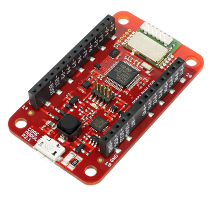

# Module Overview

## Modules

### Radio Dongle

The **Radio Dongle** is the main element of the HARDWARIO radio network. This product works as a **gateway for the HARDWARIO nodes**. It looks like a USB stick. You can plug it to your desktop, Raspberry Pi, or Turris Omnia. Also, you can look at it as an access point for **up to 32 HARDWARIO nodes**.

| [E-shop](https://shop.bigclown.com/radio-dongle/) | [Documentation](../hardware/about-radio-dongle.md) |
| :---: | :---: |

### Core Module

 The **Core Module** is the key element of every **HARDWARIO** node. It has a **32-bit ARM microcontroller** with 192 kB of flash memory and 20 kB of RAM. Besides the **integrated sub-GHz radio**for the 868/915 MHz band, it also features a digital temperature sensor, 3D accelerometer, and security chip.

| [E-shop](https://shop.bigclown.com/core-module/) | [Documentation](../hardware/about-core-module.md) |
| :---: | :---: |

### Cloony

 **Cloony** is compact version of the **Core Module**. The size is 23 x 23 mm. It has a **32-bit ARM microcontroller** with 192 kB of flash memory and 20 kB of RAM. Besides the **integrated sub-GHz radio**for the 868/915 MHz band, it also features a digital temperature sensor, and security chip.

| [E-shop](https://shop.bigclown.com/cloony/) | [Documentation](../hardware/about-cloony.md) |
| :---: | :---: |

### Mini Battery Module

 The **Mini Battery Module** is designed as a power supply source for the battery-operated units. The integrated low-power boost converter provides an excellent efficiency from the **two AAA 1.5 V Alkaline** cells. It features a bottom-entry sockets, so the overall profile of the unit you build remains low.

| [E-shop](https://shop.bigclown.com/cloony/) | [Documentation](../hardware/about-mini-battery-module.md) |
| :---: | :---: |

### Battery Module

 The **Battery Module** is designed as a power supply source for the battery-operated units. The integrated low-power buck converter provides an excellent efficiency from the **four AAA 1.5 V Alkaline** cells. It also features an extra 5-pin socket where you can connect a HARDWARIO tag.

| [E-shop](https://shop.bigclown.com/battery-module/) | [Documentation](../hardware/about-battery-module.md) |
| :---: | :---: |

### Power Module

 The **Power Module** allows you to connect a 5 V DC power adapter via a standard 2.1 mm power jack socket. It features a **high-current relay** \(230 V AC / 16 A\) to control your appliances. Also you can drive a **digital LED strip** with it \(compatible with WS2812B\).

| [E-shop](https://shop.bigclown.com/power-module/) | [Documentation](../hardware/about-power-module.md) |
| :---: | :---: |

### PIR Module

The **PIR Module** works as a **motion detector** operating on a **passive infrared**\(PIR\) principle. A typical usage of the **PIR Module** can be a wireless motion detector located on a wall or ceiling. The module is equipped with an **ultra-low-power digital sensor** from Excelitas' the DigiPyro® family.

| [E-shop](https://shop.bigclown.com/pir-module/) | [Documentation](../hardware/about-pir-module.md) |
| :---: | :---: |

### Climate Module

The **PIR Module** works as a **motion detector** operating on a **passive infrared**\(PIR\) principle. A typical usage of the **PIR Module** can be a wireless motion detector located on a wall or ceiling. The module is equipped with an **ultra-low-power digital sensor** from Excelitas' the DigiPyro® family.

| [E-shop](https://shop.bigclown.com/climate-module/) | [Documentation](../hardware/about-climate-module.md) |
| :---: | :---: |

### LCD Module

 The **LCD Module** uses a unique technology - the so-called **memory display** developed by Sharp. It provides a resolution of 128 x 128 pixels in 1.28 inch size. It implements an **ultra-low-power display controller**, so you can have active graphical display with a long service time from batteries.

| [E-shop](https://shop.bigclown.com/lcd-module-bg/) | [Documentation](../hardware/about-lcd-module.md) |
| :---: | :---: |

### Button Module

The **Button Module** is as simple as its name speaks. It has one large button that feels good to click. You can use it to trigger various actions, e.g. turn on the light, send a push notification, or control an appliance. It is connected to the BOOT signal on the **Core Module**.

| [E-shop](https://shop.bigclown.com/button-module/) | [Documentation](../hardware/about-button-module.md) |
| :---: | :---: |

### Encoder Module

 The **Encoder Module** can be useful for controlling your applications. The module is equipped with a high-quality rotary encoder manufactured by Bourns and features high reliability and durability. The rotary encoder is also equipped with a **push-button switch**.

| [E-shop](https://shop.bigclown.com/encoder-module/) | [Documentation](../hardware/about-encoder-module.md) |
| :---: | :---: |

### Relay Module

The **Relay Module** is suitable for switching small power appliances - e.g. LED strip, cooling fan, siren, buzzer, garage door opener, etc. It features a **bistable \(or latching\) relay** and that makes it suitable for battery-operated applications - the relay simply remembers its state.

| [E-shop](https://shop.bigclown.com/relay-module/) | [Documentation](../hardware/about-relay-module.md) |
| :---: | :---: |

### Sensor Module

The **Sensor Module** features **up-to four universal inputs or outputs** on a pluggable terminal block with **1-Wire bus master** support. The terminals can be used as both analog and digital input/output. For example you can connect various external digital, analog or resistive sensors. Also, you can communicate with other devices on a 1-Wire bus.

| [E-shop](https://shop.bigclown.com/sensor-module/) | [Documentation](../hardware/about-sensor-module.md) |
| :---: | :---: |

### Sigfox Module

 The **Sigfox Module** allows you to communicate to the **Sigfox wireless network**, a global network made for the IoT. This technology makes it possible to communicate from a battery-powered device directly to server, even for several years. The **Sigfox Module** uses radio frequency 868 MHz.

| [E-shop](https://shop.bigclown.com/bundle-sigfoxmodule-mysigfoxplatinum3y/) | [Documentation](../hardware/about-sigfox-module.md) |
| :---: | :---: |

### 1-Wire Module

The **1-Wire Module** allow you to connect I²C devices over a distance of several meters. The I²C protocol is encapsulated to a 1-Wire protocol. The data are protected using 16-bit CRC. You can use the **Sensor Module** to create a 1-Wire bus master.

| [E-shop](https://shop.bigclown.com/1-wire-module/) | [Documentation](../hardware/about-1-wire-module.md) |
| :---: | :---: |

### Cover Module

The **Cover Module** is a simple mechanical part that helps to cover the front face of the HARDWARIO electronics \(larger format 88 x 55 mm\). It looks great when combined with one of our 3D-printed enclosure. You simple snap it in the HARDWARIO socket header using the bottom pins.

| [E-shop](https://shop.bigclown.com/cover-module/) | [Documentation](../hardware/about-cover-module.md) |
| :---: | :---: |

### Tag Module

 The **Tag Module** makes it possible to **connect up to six HARDWARIO tags**. There are two independent I²C buses \(I2C0 and I2C1\) - one on each side. This allows to connect two tags of the same I²C address to a single HARDWARIO node. It also features pull-up resistors on SDA/SCL signals of I2C1 bus.

| [E-shop](https://shop.bigclown.com/tag-module/) | [Documentation](../hardware/about-tag-module.md) |
| :---: | :---: |

### Base Module

 The **Base Module** works as a mechanical stand for the HARDWARIO units. With the exception of the **Battery Module**, you can plug any other HARDWARIO module into a standardized socket available on the **Base Module**. It also features a **prototyping area** for soldering your own circuits.

| [E-shop](https://shop.bigclown.com/base-module/) | [Documentation](../hardware/about-base-module.md) |
| :---: | :---: |

### Breadboard Module

 The **Breadboard Module** offers an easy way to connect any HARDWARIO module to your breadboard. The narrowed breakout provides more space for wiring and prototyping. The precision pin headers from the bottom side allow smooth insertion to your breadboard and do not stress the breadboard's sockets.

| [E-shop](https://shop.bigclown.com/breadboard-module/) | [Documentation](../hardware/about-breadboard-module.md) |
| :---: | :---: |

### Probe Module

 The **Probe Module** allows you to easily hook up an **oscilloscope** or **logic analyzer** on any signal of the HARDWARIO header. Sometimes during the development you need to analyze the signals and see what's going on. And this module makes the task fast and convenient.

| [E-shop](https://shop.bigclown.com/probe-module/) | [Documentation](../hardware/about-probe-module.md) |
| :---: | :---: |

## Tags

### Temperature Tag

 The **Temperature Tag** uses a high-accuracy **temperature sensor** TMP112 with a typical accuracy of ±0.1 °C at 25 °C. This sensor is digital and calibrated. It communicates using an I²C bus and features a very low power operation and shutdown mode.

| [E-shop](https://shop.bigclown.com/temperature-tag/) | [Documentation](../hardware/about-temperature-tag.md) |
| :---: | :---: |

### Humidity Tag

The **Humidity Tag** uses a high-accuracy **humidity sensor** SHT20 with a typical accuracy of ±3 % from 20 % to 80 %. This sensor is digital and calibrated. It communicates using an I²C bus and features a very low power operation and shutdown mode.

| [E-shop](https://shop.bigclown.com/humidity-tag/) | [Documentation](../hardware/about-humidity-tag.md) |
| :---: | :---: |

### Lux Meter Tag

The **Lux Meter Tag** uses a high dynamic range **light intensity sensor** OPT3001 that can measure illuminance from 0.01 to 83,000 lux. This sensor is digital and calibrated. It communicates using an I²C bus and features a very low power operation and shutdown mode.

| [E-shop](https://shop.bigclown.com/lux-meter-tag/) | [Documentation](../hardware/about-lux-meter-tag.md) |
| :---: | :---: |

### Barometer Tag

 The **Barometer Tag** allows you to measure absolute pressure in the range from 20 kPa to 110 kPa, or altitude above the sea level in meters. It uses a low-power I²C sensor MPL3115A2 with an absolute accuracy of ±0.4 kPa. It features a very low active and standby current.

| [E-shop](https://shop.bigclown.com/barometer-tag/) | [Documentation](../hardware/about-barometer-tag.md) |
| :---: | :---: |

### VOC Tag

 The **VOC Tag** is a gas sensor for measuring **volatile organic compounds \(VOC\) concentration**. This is useful for indoor air quality monitoring applications. This module uses a metal-oxide multi pixel sensor SGP30 from Sensirion measuring total VOC level.

| [E-shop](https://shop.bigclown.com/voc-tag/) | [Documentation](../hardware/about-voc-tag.md) |
| :---: | :---: |

### NFC Tag

The **NFC Tag** operates as a **dual port memory**. You have the the NFC protocol from one side and the I²C bus interface from the other side. It features a 1 kB EEPROM memory. The chip does not have to be powered when being accessed from the NFC side.

| [E-shop](https://shop.bigclown.com/nfc-tag/) | [Documentation](../hardware/about-nfc-tag.md) |
| :---: | :---: |

