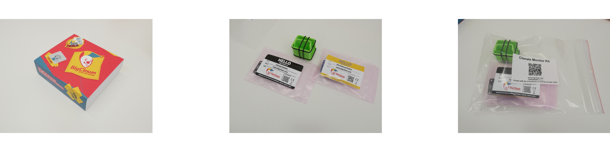

# Quick Start Guide

## Thank You, Dear Maker!

If you are reading this QUICK START GUIDE you have probably purchased our BigClown IoT Kit. If not, go [shopping](https://shop.bigclown.com/) to do so :\)

Once again **THANK YOU** for being our supporter, we really appreciate this.

BigClown is not just about the hardware but it comes with full documentation, tutorials, software tools and most importantly - it comes with the extensive **technical support**. So don't hesitate to use one of these channels In case you run in troubles or if anything is not clear to you:

* Use the online chat icon in the bottom right corner
* Write us an email to [support@bigclown.com](mailto:support@bigclown.com)
* Use forum at [https://forum.bigclown.com/](https://forum.bigclown.com/)

## Be Inspired

It's always hard to build something without an inspiration. We motivate our makers to share their work with others and you can get ideas for your projects by [subscribing to our Clownsletter](http://eepurl.com/drGLGf).

## Get Ready

In our world it means to prepare a center of your IoT system - the Hub. In QUICK START GUIDE we will use your computer as a Hub. Just follow these steps:

1. In delivered box or suitcase find a **Radio Dongle** and plug it to any USB port of your notebook or PC.
2. Download the latest Playground:

 * 32 bit:
   * [non-installable](https://github.com/bigclownlabs/bch-playground/releases/download/v0.11.0/bigclown-playground-0.11.0-windows-32bit.exe)
   * [installable](https://github.com/bigclownlabs/bch-playground/releases/download/v0.11.0/bigclown-playground-0.11.0-win-setup-32bit.exe)
 * 64 bit:
   * [non-installable](https://github.com/bigclownlabs/bch-playground/releases/download/v0.11.0/bigclown-playground-0.11.0-windows-64bit.exe)
   * [installable](https://github.com/bigclownlabs/bch-playground/releases/download/v0.11.0/bigclown-playground-0.11.0-win-setup-64bit.exe)

 * [DMG](https://github.com/bigclownlabs/bch-playground/releases/download/v0.11.0/bigclown-playground-0.11.0-macos.dmg)

 * DEB:
   * [amd64](https://github.com/bigclownlabs/bch-playground/releases/download/v0.10.1/bigclown-playground-0.10.1-linux-amd64.deb)
   * [i386](https://github.com/bigclownlabs/bch-playground/releases/download/v0.10.1/bigclown-playground-0.10.1-linux-i386.deb)
 * .tar.gz:
   * [ia32](https://github.com/bigclownlabs/bch-playground/releases/download/v0.10.1/bigclown-playground-0.10.1-linux-ia32.tar.gz)
   * [x64](https://github.com/bigclownlabs/bch-playground/releases/download/v0.10.1/bigclown-playground-0.10.1-linux-x64.tar.gz)
 * AppImage:
   * [x86\_64](https://github.com/bigclownlabs/bch-playground/releases/download/v0.10.1/bigclown-playground-0.10.1-linux-x86_64.AppImage)

3. Run the **BigClown Playground**, go to the **Device** tab, choose the **Radio Dongle** serial port and click **Connect**


If you cannot see Radio Dongle in the devices, please see the [Troubleshooting](https://www.bigclown.com/doc/basics/quick-start-guide/#troubleshooting) chapter.


1. Radio kits delivered together with your [Radio Dongle](https://shop.bigclown.com/radio-dongle) are already programmed and paired, please check that out in the image below.


In the future we recommend to use as a Hub our ready-to-use [BigClown Hub](https://shop.bigclown.com/bigclown-hub)or just plug our Radio Dongle to [Raspberry Pi](https://www.bigclown.com/doc/tutorials/raspberry-pi-installation/) or [any server](https://www.bigclown.com/doc/tutorials/custom-setup-on-raspberry-pi/#setup-on-original-raspbian).


## Build devices

By building devices we mean putting modules and enclosure together, optionally flashing a new firmware and pairing devices with a Radio Dongle.

**QUICK START GUIDE** recommends to follow this steps:

1. Build delivered kits or build devices from modules \(check the [video guides](https://www.youtube.com/playlist?list=PLfRfhTxkuiVyc9P1TWw_DnAeh2INXwpFK) how to do so\). Do not put batteries to the battery modules yet and be careful how to connect [Mini Battery](https://shop.bigclown.com/mini-battery-module) Module from the right side.  

1. 1. Test
2. 

|  |  |
| :--- | :--- |

|  |  |
| :--- | :--- |

|  |  |
| :--- | :--- |

As mentioned, delivered kits are already programmed with a right firmware. If you would like to change it to another firmware in the Core Module, please follow this [firmware flash chapter](https://www.bigclown.com/doc/projects/radio-door-sensor/#flash-door-sensor-firmware).

### Step \#2: Radio Pairing

As mentioned, kits delivered together with Radio Dongle are already paired and should be visible in Playground's **Device** tab. In case you need to pair new devices, please follow these [radio pairing instructions](https://www.bigclown.com/doc/projects/radio-door-sensor/#pair-the-radio-door-sensor).

1. Switch to Playground's **Messages** tab and put batteries to your kit, you should see incoming messages. Every kit sends different messages. Here the **Button kit** sends _temperature, voltage, event-count_ \(everytime you press the button\) and other messages.

1. Put modules to the 3D-printed enclosure and fix it with O-rings.

## Add function

Now it's time to give your system a logic and connect it with desired platforms.

In **QUICK START GUIDE** we will create a simple dashboard with a temperature gauge. Again, just follow these steps:

1. Switch to the **Messages**, you should see incoming messages from the previous step. Copy the **bold** text \(called **topic**\) that ends with _temperature_ **to the clipboard**. Make sure you copy just text and no space before or after the text. Your **topic** could be different based on your kit name. You can also copy any other topic that your module supports from the [MQTT topics list](https://www.bigclown.com/doc/interfaces/mqtt-topics/).

1. Switch to the **Function** tab and from the color blocks on the left side drag and drop **mqtt** block and **gauge** block to the **flow** in the middle of the screen. The color blocks are called **nodes**. You can use the `filter nodes` text box to find the right block. Connect the two created nodes together.

1. Double click on the **gauge** node. Change **Label**, **Units** and **Range** to your needs. Then click **Done**.
2. Double click on the **mqtt** node and paste the previously copied topic from the clipboard. Make sure there are not any spaces before and after the copied text. Then click **Done** and **Deploy** button. You have to click on the **Deploy** everytime you make changes in your flow.

1. Go to Playground's **Dashboard** tab and you should see a gauge with the temperature of the selected device. The temperature can take a while to appear. You can breathe on the module or reconnect batteries for immediate update.

## Share

Don't be shy and share your projects with others. We will reward you by a **100 EUR**discount coupon if your project will be displayed on our web.

Or just put the red nose on, make a selfie and share it on Facebook or Twitter with a hashtag **\#Clownfie** and you will get a **10 EUR** discount coupon.

## Learn More   

The goal of this **QUICK START GUIDE** is to show the basics in a few simple steps. Now you can learn more by browsing the **documentation** or by visiting the **links below**.

* Check out other BigClown [projects](https://www.bigclown.com/doc/projects/radio-door-sensor/).
* Take a look at the [Module Overview](https://www.bigclown.com/doc/basics/module-overview/).
* Learn about [MQTT](https://www.bigclown.com/doc/interfaces/mqtt-protocol/) and [BigClown MQTT topics](https://www.bigclown.com/doc/interfaces/mqtt-topics/) to control LEDs and relays.
* Try other [integrations](https://www.bigclown.com/doc/integrations/grafana-for-visualization/) with **Grafana**, **Blynk**, **IFTTT**, **Ubidots** and others.
* Use your [Raspberry PI](https://www.bigclown.com/doc/tutorials/raspberry-pi-installation/) or other [single board computer \(SBC\)](https://www.bigclown.com/doc/tutorials/custom-setup-on-raspberry-pi/#setup-on-original-raspbian) as a server.
* [Flash other firmware](https://www.bigclown.com/doc/projects/radio-door-sensor/#flash-door-sensor-firmware.en.md) or [write your own firmware](https://www.bigclown.com/doc/firmware/basic-overview/) for the **Core Module**.
* Check the [Core Module pinouts](https://www.bigclown.com/doc/hardware/header-pinout/) and add your own buttons, relays and sensors.

## Troubleshooting   

Cannot find the Radio Dongle or Core Module in the device list

* On Windows 7 and macOS please install the [FTDI VCP drivers](https://www.ftdichip.com/Drivers/VCP.htm)
* On Ubuntu you need to be in `dialout` user group. Please use command `sudo usermod -a -G dialout $USER` and restart computer
* BigClown Playground cannot flash older Core Module Revision 1. Please use the `bcf`tool. See [version comparison](https://www.bigclown.com/doc/hardware/core-module-1-and-2-comparison/)

