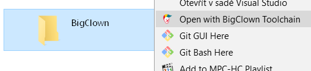
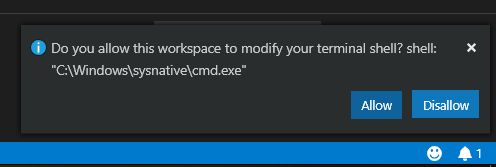

# Firmware Quick Start

You can easily edit or create your own custom firmware for BigClown Core Module on Windows, [Linux](toolchain-setup.md#setup-on-ubuntu) or [macOS](toolchain-setup.md#setup-on-macos). 


In the [next chapters in Firmware group](basic-overview.md) you can find more details for each step explained here.


## Windows

1. Download and Install [VSCode IDE](https://code.visualstudio.com/) first
2. Download and Install [BigClown Toolchain](https://github.com/bigclownlabs/bch-toolchain-windows/releases), keep the default install options if in doubt \([details](toolchain-setup.md#setup-on-windows)\)
3. Create BigClown folder where all your BigClown projects will be located and right-click on that folder and choose Open with BigClown Toolchain 

   

4. Create a new project skeleton using [bcf](../tools/bigclown-firmware-flashing-tool.md) by typing `bcf create my_project`
5. Go to the new created folder by typing `cd my_project`
6. Run VSCode by typing `code .` \(note the dot "."\)
7. Build firmware by pressing `Ctrl+Shift+B`, VSCode may ask in the bottom right corner if you would like to use different Shell. Confirm that and try to build project again.  
8. Connect Core Module and flash the firmware by pressing `Ctrl + P` and typing `task flash`. In the terminal window the flasher will ask for COM port, if you have just one, type zero `0` and press Enter


The Core Module is flashed. The red LED will turn on, when you press the button the LED toggles.



You can also follow a detailed [Windows toolchain installation guide](toolchain-setup.md#setup-on-windows) and [Toolchain Guide](toolchain-guide.md) chapter.


#### Detailed explanation

If you install BigClown Toolchain with **default options**, then the compiler and make tool will not be added to the `PATH` environment variable, but only in the BigClown Toolchain Console. That's why you have to run VSCode from the Toolchain command line so the VSCode will know where to look for `make` and `bcf` tool.

You can upgrade any Windows command line to BigClown Toolchain command line by typing `bct`.

If you you check all the options during installation of the BigClown Toolchain, then the paths of the installed tools is added to `PATH` environment variable. Then you can open the VSCode from start menu and it will know how to compile and flash because `make` and `bcf` will be also available in the default Windows command line.

VSCode now uses PowerShell, that's why you have to confirm that you would like to use normal Windows command line.

## Linux/Ubuntu

1. Install [GCC toolchain and tools](toolchain-setup.md#setup-on-ubuntu). Optionally install [VSCode IDE](https://code.visualstudio.com/).
2. Create a new project skeleton using [bcf](../tools/bigclown-firmware-flashing-tool.md) by typing `bcf create my_project`
3. Go to the new created folder by typing `cd my_project`
4. Run VSCode by typing `code .` \(note the dot "."\) or open project folder in VSCode.
5. Build firmware by pressing `Ctrl+Shift+B`
6. Connect Core Module and flash the firmware by pressing `Ctrl + P` and typing `task flash`. In the terminal window the flasher will ask for COM port, if you have just one, type zero `0` and press Enter


The Core Module is flashed. The red LED will turn on, when you press the button the LED toggles.



You can continue by reading [Toolchain Guide](toolchain-guide.md) chapter.


## macOS

1. Install [GCC toolchain and tools](toolchain-setup.md#setup-on-macos). Optionally install [VSCode IDE](https://code.visualstudio.com/).
2. Create a new project skeleton using [bcf](../tools/bigclown-firmware-flashing-tool.md) by typing `bcf create my_project`
3. Go to the new created folder by typing `cd my_project`
4. Run VSCode by typing `code .` \(note the dot "."\) or open project folder in VSCode.
5. Build firmware by pressing `Ctrl+Shift+B`
6. Connect Core Module and flash the firmware by pressing `Ctrl + P` and typing `task flash`. In the terminal window the flasher will ask for COM port, if you have just one, type zero `0` and press Enter


The Core Module is flashed. The red LED will turn on, when you press the button the LED toggles.



You can continue by reading [Toolchain Guide](toolchain-guide.md) chapter.


