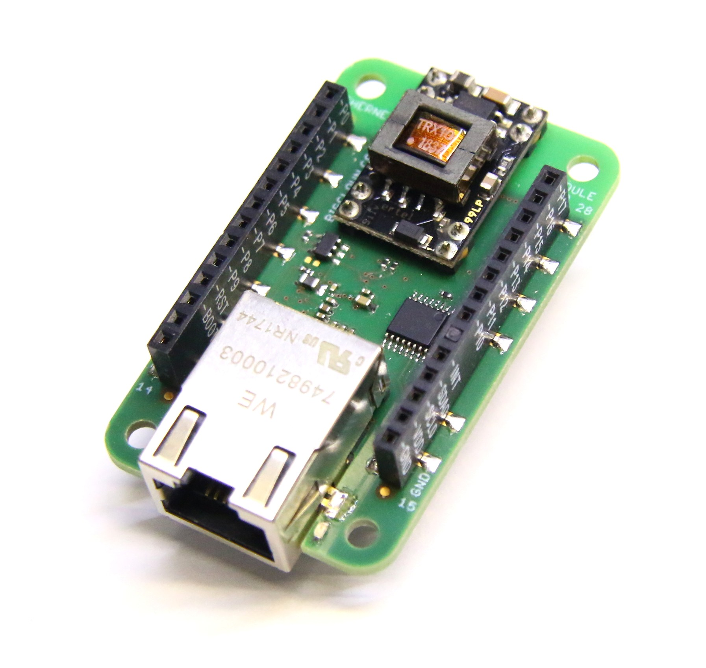

# About Ethernet Module

The Ethernet Module connects your node to the local 100 Base-T network and Internet. You can use this module to run a HTTP webserver or as an MQTT client connecting to your broker. It is using WizNet W5500 chip that is using SPI to communicate with Core Module. Optionally this module can have active PoE module that fully supports IEEE 802.3af standard.

| \*\*\*\*[**E-shop**](https://shop.bigclown.com/humidity-tag)\*\*\*\* | [**Schematic Drawing**](https://github.com/bigclownlabs/bc-hardware/tree/master/out/bc-module-ethernet) |
| :---: | :---: |

### Features 

* 100 Base-T Ethernet
* WizNet W5500
* Communication using SPI
* Optional PoE with IEEE 802.3af
* HTTP webserver
* MQTT client
* Operating voltage range: 3.0 V to 3.3 V
* Operating temperature range: -40 to 85 °C

### Resources 

* [**Documentation**](about-ethernet-module.md)
* \*\*\*\*[**Schematic drawing**](https://github.com/bigclownlabs/bc-hardware/tree/master/out/bc-module-ethernet)

### Firmware Projects 

* \*\*\*\*[**Ethernet Climate Monitor**](https://github.com/bigclownprojects/bcf-ethernet-climate-monitor)\*\*\*\*

