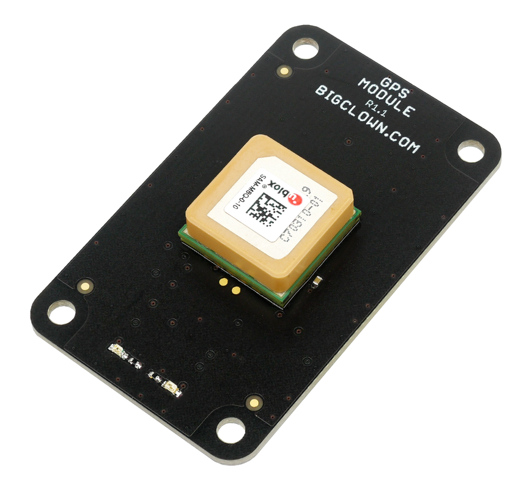

# About GPS Module

| [E-Shop](https://shop.bigclown.com/gps-module/) | [Schematic Drawing](https://github.com/bigclownlabs/bc-hardware/tree/master/out/bc-module-gps) | [SDK Library](https://sdk.bigclown.com/group__bc__module__gps.html) | [Header File](https://github.com/bigclownlabs/bcf-sdk/blob/master/bcl/inc/bc_module_gps.h) | [Source File](https://github.com/bigclownlabs/bcf-sdk/blob/master/bcl/src/bc_module_gps.c) |
| :--- | :--- | :--- | :--- | :--- |

The **GPS Module** allows you to know the exact position of your device. It is using **SAM-M8Q** module from **ublox**. It understands 3 global positioning standards GPS, Galileo and GLONASS. The 2.5 m position accuracy is possible thanks to combining position from all three standards together.

#### FEATURES

* Supports GPS, Galileo, GLONASS
* Position accuracy 2.5 m CEP
* Communication over I2C bus
* Embedded antenna
* Current consumption 26 mA in operation
* Integrated power switch for low power operation.
* Cold start 26 s, Aided start 2 s
* Operating voltage range: 2.7 V to 3.6 V
* Operating temperature range: -40 to 85 °C

