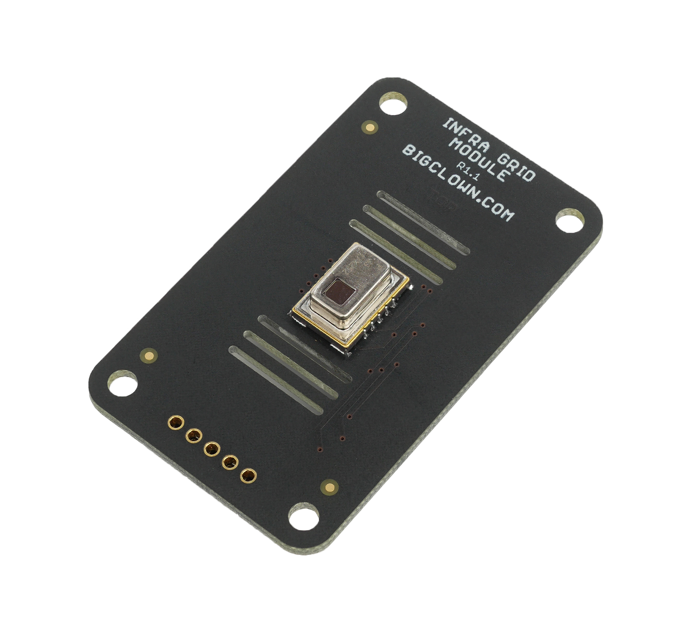

# About Infra Grid Module

**Infra Grid Module** has 64 infrared temperature sensors in 8 by 8 matrix. You can do non-contact infrared temperature measurement. Its using Panasonic Infrared Array Sensor Grid-EYE with AMG8833 chip. You can detect not just movements but also direction and size of moving object.

| [E-shop](https://shop.hardwario.com/infra-grid-module/) | [Schematic Drawing](https://github.com/bigclownlabs/bc-hardware/tree/master/out/bc-module-infra-grid) | [SDK Library](https://sdk.bigclown.com/group__bc__module__infra__grid.html) | [Header File](https://github.com/bigclownlabs/bcf-sdk/blob/master/bcl/inc/bc_module_infra_grid.h) | [Source File](https://github.com/bigclownlabs/bcf-sdk/blob/master/bcl/src/bc_module_infra_grid.c) |
| :--- | :--- | :--- | :--- | :--- |

#### Features

* Infrared images in 8 by 8 pixel resolution
* Operating voltage 3.3 V
* Temperature accuracy ±2.5 °C
* Operating and measuring temperatures 0 °C to 80 °C \(High gain sensor type\)
* Human detection distance up to 7 m
* Current consumption 4.5 mA in normal mode \(10 FPS\)
* Integrated power switch for low power operation.
* Integrated temperature sensor −20 °C to 80 °C

### Resources 

* [**Documentation**](about-infra-grid-module.md)
* [**Schematic drawing**](https://github.com/bigclownlabs/bc-hardware/tree/master/out/bc-module-infra-grid)

### Firmware Projects 

* [**Radio Infra Grid Sensor**](https://github.com/bigclownprojects/bcf-radio-infragrid-sensor)\*\*\*\*
* \*\*\*\*[**Infra Grid LCD Mirror**](https://github.com/bigclownprojects/bcf-infra-grid-lcd-mirror)\*\*\*\*

