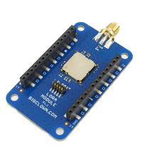

# About LoRa Module

The **LoRa Module** allows you to communicate to the **LoRaWAN wireless network**, a network made for the IoT. This technology makes it possible to communicate from a battery-powered device directly to server, even for several years. The **LoRa Module** uses radio frequency 868 MHz.

| \*\*\*\*[**E-shop**](https://shop.bigclown.com/lora-module)\*\*\*\* | [**Schematic Drawing**](https://github.com/bigclownlabs/bc-hardware/tree/master/out/bc-module-lora) | [**SDK Library**](https://sdk.bigclown.com/group__bc__cmwx1zzabz) | [**Header File**](https://github.com/bigclownlabs/bcf-sdk/blob/master/bcl/inc/bc_cmwx1zzabz.h) | [**Source File**](https://github.com/bigclownlabs/bcf-sdk/blob/master/bcl/src/bc_cmwx1zzabz.c) |
| :---: | :---: | :---: | :---: | :---: |

The **LoRa Module** allows you to communicate to the **LoRaWAN wireless network**, a network made for the IoT. This technology makes it possible to communicate from a battery-powered device directly to server, even for several years. The **LoRa Module** uses radio frequency 868 MHz.

Thanks to specific zig-zag modulation, the LoRa device can communicate with the gateway over a distance of tens kilometers.

This network has a wide range of applications. Its use is particularly useful in energy consumption meters \(e.g. water meters, gas meters, etc.\), environmental sensors \(e.g. a CO₂ sensor\), but also in applications for early reports of accidents or defects \(e.g. water leak detector\).

### Features 

* LoRaWAN module CMWX1ZZABZ-078 \(Murata\)
* Communication using UART and AT commands
* SMA antenna ANT-SS900
* Standby power consumption 2 μA
* Operating voltage range: 1.8 to 3.6 V
* Operating temperature range: -20 to 70 °C
* Dimensions: 33 x 55 mm

### Resources 

* [**Documentation**](https://www.bigclown.com/doc/hardware/about-lora-module/)
* [**Schematic drawing**](https://github.com/bigclownlabs/bc-hardware/tree/master/out/bc-module-lora)

### Firmware Projects 

* [**LoRa pulse counter kit firmware**](https://github.com/bigclownlabs/bcf-kit-lora-pulse-counter/releases)

