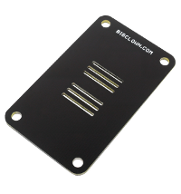

# About Mini Cover Module

The **Mini Cover Module** is a simple mechanical part that helps to cover the front face of the BigClown electronics \(smaller format 33 x 55 mm\). It looks great when combined with one of our 3D-printed enclosure. You simple snap it in the BigClown socket header using the bottom pins.

| \*\*\*\*[**E-shop**](https://shop.bigclown.com/mini-cover-module)\*\*\*\* | [**Schematic Drawing**](https://github.com/bigclownlabs/bc-hardware/tree/master/out/bc-module-cover-mini) |
| :---: | :---: |

### Resources 

* [**Documentation**](https://www.bigclown.com/doc/hardware/about-mini-battery-module/)
* [**Schematic drawing**](https://github.com/bigclownlabs/bc-hardware/tree/master/out/bc-module-battery-mini)

### Firmware Projects 

* [**Generic firmware**](https://github.com/bigclownlabs/bcf-generic-node/releases)

  Note: Use firmware for node-battery-mini

