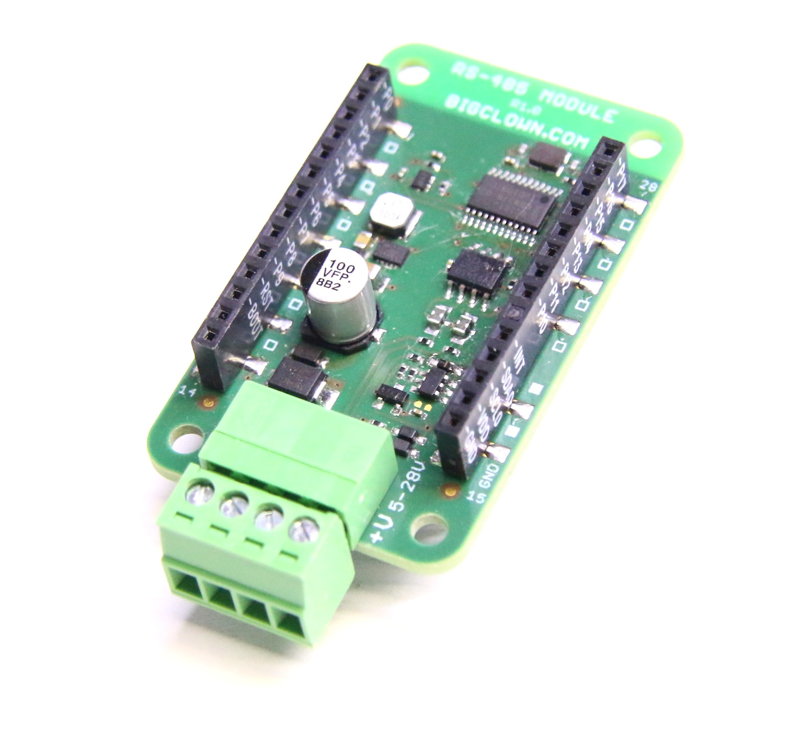

# About RS-485 Module

The **RS-485 Module** allows you to communicate over RS-485 bus using MODBUS or your custom protocol. Many devices could be connected to the single RS-485 bus and exchange data. This module also contains DC/DC converter so it can power the node. Supported input voltage is 5 - 28 V.

This module has low-power mode when data receiving is not enabled. This way RS-485 node could work for long time just from batteries.

| **E-shop** | [**Schematic Drawing**](https://github.com/bigclownlabs/bc-hardware/tree/master/out/bc-module-rs-485) | [**SDK Library**](http://sdk.bigclown.com/group__bc__module__rs485.html) | [**Header File**](https://github.com/bigclownlabs/bcf-sdk/blob/master/bcl/inc/bc_module_rs485.h) | [**Source File**](https://github.com/bigclownlabs/bcf-sdk/blob/master/bcl/src/bc_module_rs485.c) |
| :---: | :---: | :---: | :---: | :---: |

### Features 

* RS-485 communication
* Only I2C pins are used thanks to I2C to UART converter SC16IS750IPW
* Power supply with DC/DC covnerter and 5 - 28 V input voltage
* Operating voltage range: 3.0 to 3.6 V
* Operating temperature range: -40 to 85 °C
* Dimensions: 33 x 55 mm

### Resources 

* [**Documentation**](about-rs-485-module.md)
* [**Schematic drawing**](https://github.com/bigclownlabs/bc-hardware/tree/master/out/bc-module-rs-485)

### Firmware Projects 

* \*\*\*\*[**Sending and receiving raw data with RS-485 Module**](https://github.com/bigclownprojects/bcf-usb-rs485-module)\*\*\*\*

