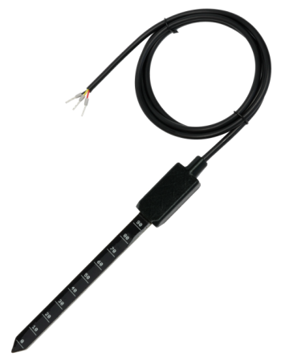

# About Soil Moisture Sensor

The **Soil Moisture Sensor** is a modern, completely sealed capacitive moisture sensor with temperature sensor. It is using 1-Wire communication protocol and has 3 wire cable that is 2 meters long. Many sensors can be connected to a single 1-Wire Master. The temperature sensor is located in the top part above the soil. The electronics is completely potted in a sealing compound to withstand all kind of weather.


Measured soil should be electrically isolated from the electronics ground.

If you connect Soil Sensor to the battery operated radio module like Core Module then you are ok. However if you connect Core Module or Arduino over USB to your computer which is also grounded over EARTH wire, then the capacitive measurement could be affected.


The sensor returns soil moisture humidity using relative values. Sensor is very sensitive and you can get range from 6500 when sensor is dry and 13000 when sensor is fully submerged into the water. Measuring is done by two copper strips inside the inner layers of the 4 layer PCB. This way the contacts are not exposed to direct humidity and do not oxidize.

It is also possible to use sensor to measure water level. 

Sensor is already supported in BigClown SDK with examples and projects.

[Arduino Library for Soil Sensor](https://github.com/bigclownlabs/arduino-soil-sensor) is also available \(you will also need [DS28E17 library](https://github.com/bigclownlabs/arduino-DS28E17)\). 

| [**E-shop**](https://shop.bigclown.com/soil-moisture-sensor/)\*\*\*\* | [**Schematic Drawing**](https://github.com/bigclownlabs/bc-hardware/tree/master/out/bc-soil-sensor) | [**SDK Library**](https://sdk.bigclown.com/group__bc__soil__sensor.html) | [**Header File**](https://github.com/bigclownlabs/bcf-sdk/blob/master/bcl/inc/bc_soil_sensor.h) | [**Source File**](https://github.com/bigclownlabs/bcf-sdk/blob/master/bcl/src/bc_soil_sensor.c) |
| :---: | :---: | :---: | :---: | :---: |


We do not recommend to put the top part of the sensor under the ground. Ground planes in this area could affect the measurement electrodes and precision.


### Features 

* Soil moisture sensor
* Fully digital design
* 1-Wire bus communication
* Possibility to connect multiple sensors in parallel
* Capacitance-to-digital converter ZSSC3123
* Digital temperature sensor TMP112
* Operating voltage range: 2.8 V to 5.5 V
* Operating temperature range: -40 to +85 °C
* Protection marking IP 68

### Firmware examples

* [How To: Soil Moisture Sensor](../firmware/how-to-soil-moisture-sensor.md)

### Projects 

* [Radio Soil Sensor](../projects/radio-soil-sensor.md)

