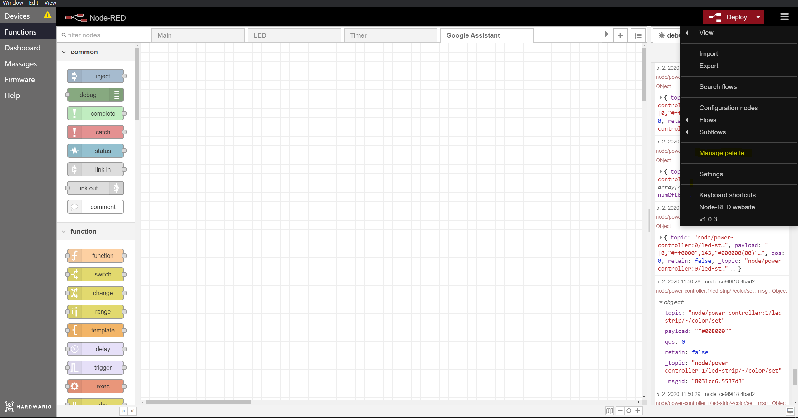
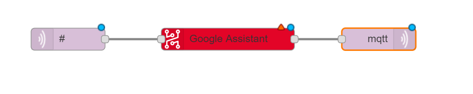
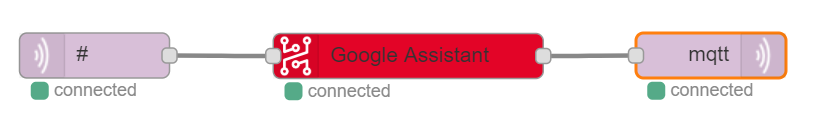
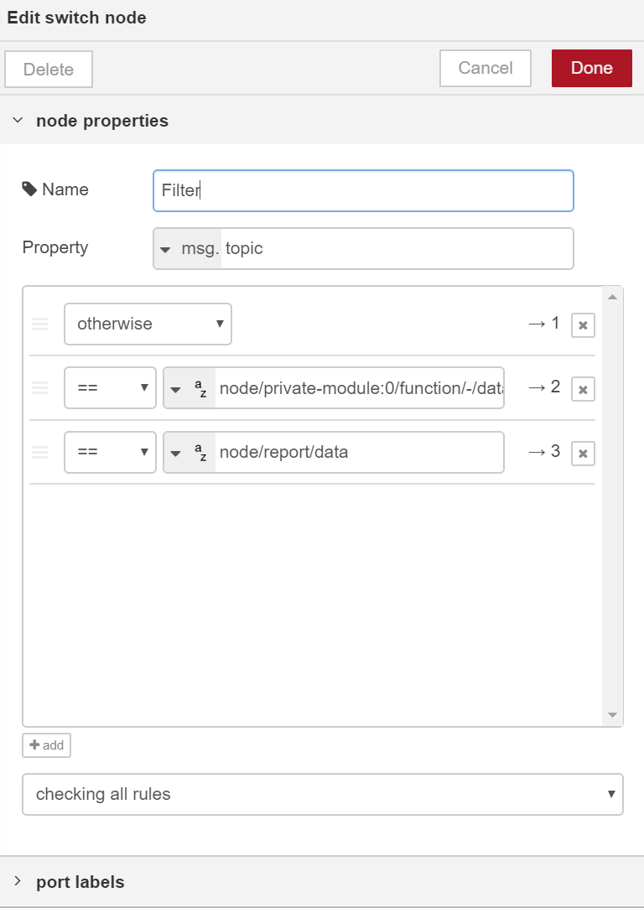
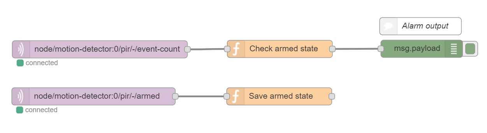

# Google Assistant

With the Google Assistant integration, you can control your HARDWARIO IoT Kits with the Google Assistant.

For now, you can control:

- [Power Controller Kit](https://shop.hardwario.com/power-controller-kit/)
- [Radio Dongle](https://shop.hardwario.com/radio-dongle/)
- [Push Button Kit](https://shop.hardwario.com/push-button-kit/)
- [Motion Detector](https://shop.hardwario.com/motion-detector-kit/) (see the instructions at the end)
- [Climate Monitor](https://shop.hardwario.com/climate-monitor-kit/)


**What is Google Assistant?**  
Google Assistant is a voice assistant, made by Google. Available on bilions of devices, you can use it to do many things. Now, even control your HARDWARIO IoT Kits.


## Setup

Setup will be done in 2 steps:

1. Adding Node-RED nodes to enable Google Assistant support
2. Google Home app set-up

## Prepare your modules

Please set up at least one of the supported modules using [Projects guides](../projects/push-the-button.md) with the standard firmware. Google Assistant will use Node-RED to communicate with your Hub in the background and fulfill your commands.

**Make sure you have your kit successfully running before you move to next steps.**

## Node-RED setup

### **Step 1: Open Node-RED**

Open **Node-RED** in [**HARDWARIO Playground**](https://developers.bigclown.com/basics/bigclown-playground) in the **Functions** tab or in your web browser [**http://localhost:1880/**](http://localhost:1880/)

### **Step 2: Install Node-RED package**

Select _Manage pallete_ from the right menu



Click on **install tab** and type _hardwario_ into the search field. Confirm *@hardwario/node-red-contrib-hardwario-voice* by pressing install.


### **Step 2: Import flow**

Open the right menu -> Import -> Examples and select HARDWARIO Google Assistant from the package folder


Or import following JSON:

```text
[{"id":"90a4c19d.773d5","type":"mqtt out","z":"f12ddf57.809","name":"","topic":"","qos":"","retain":"","broker":"a5605d5c.f080e","x":702.000020980835,"y":767.0000238418579,"wires":[]},{"id":"8326e88f.cf6338","type":"mqtt in","z":"f12ddf57.809","name":"","topic":"#","qos":"2","broker":"9f1d47fd.82cff8","x":251.00000381469727,"y":768.0000228881836,"wires":[["d9d67844.d6f638","77456e04.0fb01"]]},{"id":"77456e04.0fb01","type":"hardwario-voice","z":"f12ddf57.809","name":"","cred":"","x":475.16668701171875,"y":767.3333129882812,"wires":[["90a4c19d.773d5"]]},{"id":"a5605d5c.f080e","type":"mqtt-broker","z":"","broker":"localhost","port":"1883","clientid":"","usetls":false,"compatmode":true,"keepalive":"60","cleansession":true,"willTopic":"","willQos":"0","willPayload":"","birthTopic":"","birthQos":"0","birthPayload":""},{"id":"9f1d47fd.82cff8","type":"mqtt-broker","z":"","broker":"localhost","port":"1883","clientid":"","usetls":false,"compatmode":true,"keepalive":"60","cleansession":true,"willTopic":"","willQos":"0","willPayload":"","birthTopic":"","birthQos":"0","birthPayload":""}]
```

It will look like this:




This snippet prepares Node-RED to fulfill commands from Google Assistant while updating the devices states


### Step 3: Get your Auth token

Go to [HARDWARIO Auth page](hardwario.com) and sign in using a Google Account which you are using with Google Assistant. In your email, you will receive an Auth token.

### Step 4: Configure

Configure the **Google Assistant node** with the correct Auth token.
Use the pencil icon on the right to create a new token config with your token.

### Step 5: Deploy

Deploy the flow using the **Deploy** button in the top-right corner.

The nodes should after a few seconds show the _connected_ status like this:



### Step 6: Make sure it's connected

After that, all Blynk nodes should have a green indicator at the bottom and say connected. Make sure that Blynk project is running in your phone \(Play icon was pressed\)

### Possible errors

- _Missing token_
  - Make sure that your Auth token is correctly filled out
- _Pairing error_
  - Verify that your Auth token and the token you have received in your email match
- _Not receiving/sending any messages_
  - Try to restart Node-RED/HARDWARIO Playground, if it doesn't resolve the issue, contact us in the chat

## Google Assistant setup

To complete Google Assistant setup, **you need a mobile device**.

### Step 1: Google Home app

Open the Google Home app ([Android](https://play.google.com/store/apps/details?id=com.google.android.apps.chromecast.app&hl=en), [iOS](https://apps.apple.com/us/app/google-home/id680819774))

### Step 2: Add device

Press the + button in the top left corner to add a new device.

## Example commands

Get some inspiration for things you can say!

Hey Google:

- Turn on the Power Controller
- Turn off relay on Power Controller
- Set the color to red
- Set the brightness to 50%
- Lower the brightness
- What is the temperature of Push Button
- What is the humidity of Climate Monitor
- Turn on the Push Button
- Disarm the Motion Detector
- Turn on the Radio Dongle (starts pairing mode)

## Other

### Filter send messages

Use the **Switch node** for any messages that you don't want to be sent to the Google Assistant. Place the switch node between the MQTT out and Google Assistant node and connect just the first output to the Google Assistant node.

Fill out all the message topics that you don't want to be sent.




### Rename your modules

Use the Google Home app to change the default names to something you like.

### Motion Detector setup

You can arm/disarm the [Motion Detector](https://shop.hardwario.com/motion-detector-kit/) using Google Assistant. It will send the following MQTT message:

```javascript
{
    payload: true, // true or false
    topic: `node/motion-detector:0/pir/-/armed`,
}
```

You can use this message to create conditions and flow to limit the Motion Detector.

Feel free to modify the example you can get from _Menu -> Import -> Examples -> Package name -> Alarm example_


