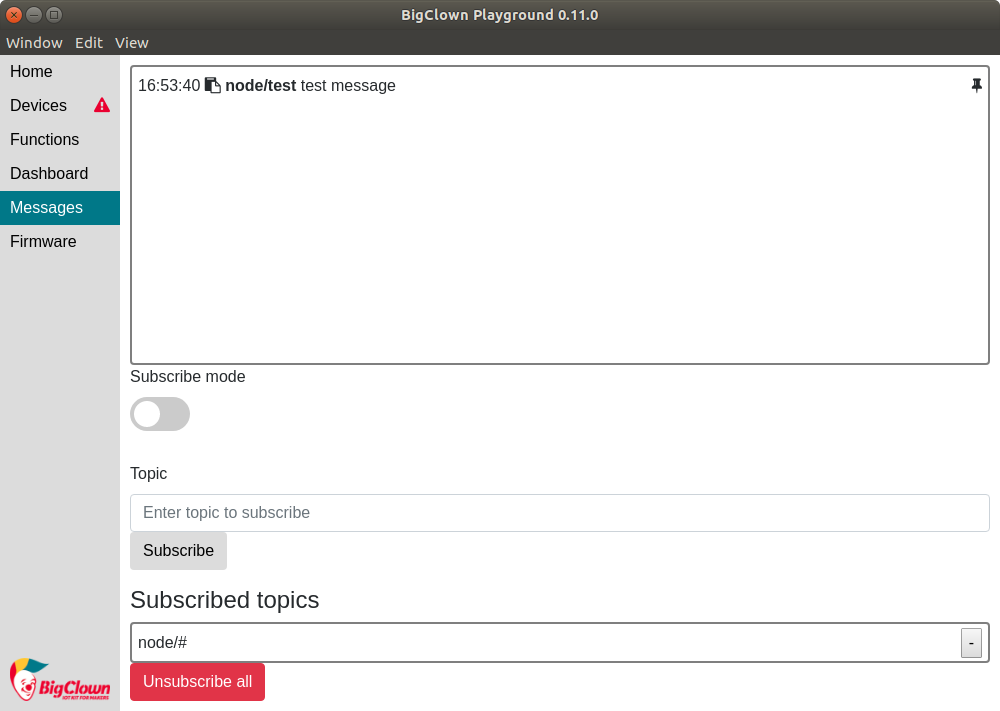
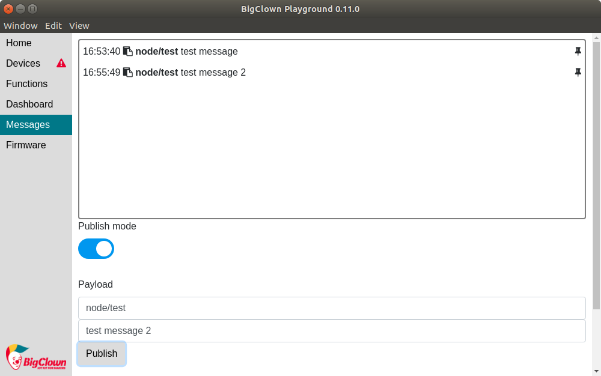

# MQTT Protocol

* MQTT is open, simple and low overhead communication protocol for sending messages between many clients which are connected to the central MQTT broker.
* Every **message** contains two parts - **topic** and **payload**.
* Topic describes content of the message.
* Topic name contains "directory" structure - each level is divided with symbol `/`.
* Topic can be `bedroom/temperature` or `kitchen/light/set`.
* MQTT server is called the **broker** and clients can **publish** messages and **subscribe**to different topics.
* The task of MQTT broker is to deliver messages from **publishers** to the **subscribers**.
* You can use the `+` symbol to subscribe to all topics in the current topic \(`+/light/set`\) and `#` symbol to subscribe to all sub-topics \(`kitchen/#`\).


The symbol `#` can be used only at the end of the topic name.


[More information about MQTT topics](http://www.hivemq.com/blog/mqtt-essentials-part-5-mqtt-topics-best-practices)

## Mosquitto MQTT broker <a id="mosquitto-mqtt-broker"></a>

BigClown is using open-source [Mosquitto](https://mosquitto.org/) MQTT broker. All messages are routed through MQTT broker. This allows further expansion of BigClown system.

When you connect the Core Module or Radio Dongle with connected remote node, you can display all incoming messages using `mosquitto-cli` package by typing:

```text
mosquitto_sub -t "#" -v
```

Response:

```text
pi@hub:~ $ mosquitto_sub -t "#" -v
node/836d19821664/thermometer/0:1/temperature 24.69
node/836d19821664/thermometer/0:1/temperature 24.94
node/836d19821664/push-button/-/event-count 5
```

## BigClown Playground as GUI tool for MQTT messages

You can use [BigClown Playground](../basics/quick-start-guide.md#2-download-the-latest-playground) for subscribing and publishing MQTT messages. You can do it in Messages tab.


### Subscribe

Subscribe mode is default mode when you open Messages tab in Playground. In beginning you have already subscribed `node/#` topic. We can try to send MQTT messages with payload `test message` and topic `node/test` by typing following command.

```text
mosquitto_pub -t "node/test" -m "test message"
```

Now you can see test message in Playground message window.



### Publish

You can also publish message from Playground. Just switch to Publish mode, type topic and payload and Publish your message. You can see it in message window on top of Messages tab.



