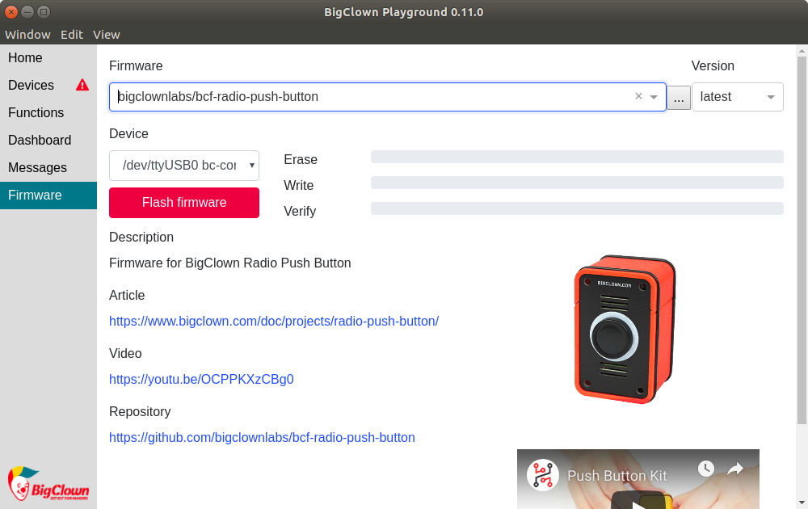

# Quick Tutorial

## Basics


You can follow this tutorial even without Raspberry Pi. You just have to install [**BigClown Playground**](https://www.bigclown.com/doc/basics/quick-start-guide/) on your desktop. The Raspberry Pi approach is the easiest because you can download bc-rasbian image with pre-installed tools.


This document is a practical guide of using the **BigClown IoT Kit**. It will guide you how **Raspberry Pi** can read the temperature from **Core Module**, control the LED, measure the relative air humidity from **Humidity Tag**, control small electronic devices using **Relay Module**.

You will also be able to create a wireless network using **Radio Dongle**. Data acqusition and control process is demonstrated using **Node-RED**, a web application that will run inside the **Raspberry Pi**. This application allows intuitive graphical automation flow editing directly in your web browser.


Do you have **Radio Dongle** and **wireless kit**? If you would like to start creating you wireless network, you can later jump directly to the [**Creation of the wireless network chapter**](https://www.bigclown.com/doc/tutorials/raspberry-pi-tutorial/#creation-of-the-wireless-network) when you get the basic knowledge of **Gateway**, `bcf` **firmware flashing tool** and **Node-RED** in the chapters below.


First we will demonstrate basic functionality without a wireless network. We use just a single **Core Module** connected to the **Raspberry Pi** by a USB cable.

What will we need at minimum:

* [Raspberry Pi](https://shop.bigclown.com/raspberry-pi-3-set) + [MicroSDHC Memory Card 8GB](https://shop.bigclown.com/microsdhc-card-8gb)
* [Core Module](https://shop.bigclown.com/core-module)

  Optionally for establishing a wireless network, you will need:

* [Radio Dongle](https://shop.bigclown.com/radio-dongle) \(or second one [Core Module](https://shop.bigclown.com/core-module)\)
* [Mini Battery Module](https://shop.bigclown.com/mini-battery-module)
* [Humidity Tag](https://shop.bigclown.com/humidity-tag) or [Climate Module](https://shop.bigclown.com/climate-module)
* [Relay Module](https://shop.bigclown.com/relay-module)

## Video Tutorial



## Raspberry Pi

### Raspberry Pi Installation <a id="raspberry-pi-installation"></a>


Detailed instructions can be found in the document [**Raspberry Pi Installation**](https://www.bigclown.com/doc/tutorials/raspberry-pi-installation/).


The easiest way to start is to download the [**BigClown Raspbian**](https://github.com/bigclownlabs/bc-raspbian/releases) image. This image has already pre-installed necessary components. It contains [**BigClown Gateway**](https://www.bigclown.com/doc/tools/bcg/) `bcg`, **Mosquitto** MQTT broker, **Node-RED** and [**BigClown Firmware Tool**](https://www.bigclown.com/doc/tools/bcf/) `bcf`.

The downloaded **Raspberry Pi** image has to be written to a MicroSD card using the multi-platform **GUI tool** [**balenaEtcher**](https://www.balena.io/etcher/), [**Win32DiskImager**](https://sourceforge.net/projects/win32diskimager/) or command line `dd` tool.

You can also download the official **Raspbian** and install necessary packages yourself.

### Raspberry Pi Login <a id="raspberry-pi-login"></a>


Detailed instructions can be found in the document [**Raspberry Pi Login**](https://www.bigclown.com/doc/tutorials/raspberry-pi-login/).


1. Insert the MicroSD card with the **Raspbian** image to the **Raspberry Pi**.
2. Connect the Ethernet cable to the **Raspberry Pi**.
3. Connect the **Core Module** or the **Radio Dongle** to the **Raspberry Pi**.
4. Connect the power adapter to the **Raspberry Pi**.

After the **Raspberry Pi** boots up you should be able to find it at address [`http://hub.local`](http://hub.local). You can try the command `ping hub.local` and see the response.


If the Raspberry Pi is not visible on the network, there's something wrong with your network setup or your system doesn't support **mDNS** and you have to find the IP address of the **Raspberry Pi** in your router's **DHCP**configuration or by using [**Fing**](https://www.fing.io/) which is a simple smartphone application.


 Please log on the Raspberry Pi shell by typing `ssh pi@hub.local` command or use the Windows program **PuTTY**.

## Firmware upload via:

### BigClown Playground

Download the latest BigClown Playground from [Quick Start Guide](../basics/quick-start-guide.md#2-download-the-latest-playground) and open it. Navigate to Firmware, connect Core Module via USB to computer and choose firmware to flash.



### Command-line tool


 Detailed instructions can be found in the document [**Toolchain Guide**](https://www.bigclown.com/doc/firmware/toolchain-guide/).


For quick start we've create a Python command-line utility **bcf**, which automatically downloads latest released firmwares from **GitHub** and will flash the modules. On the Raspberry Pi you need first to update the list of releases by typing `bcf update`. Then by typing `bcf list` you get the list of pre-compiled firmwares.


**Flashing Core Module R1 & R2**  
For differences of flashing older **Core Module 1** and newer **Core Module 2** please read **Core Module R1 and R2 comparison** in the **Hardware section**


```text
bcf flash bigclownlabs/bcf-radio-push-button:latest
```

Than you will choose between connected devices:

```text
bcf flash bigclownlabs/bcf-radio-push-button:latest
0 /dev/ttyUSB0
Please enter device: 0
```


After the firmware flashing the **Core Module** will automatically restart and the flashed firmware will be run.


## Radio Dongle to MQTT communication gateway

**Radio Dongle** or **Core Module** with the **gateway** firmware is using virtual serial port over USB to exchange the data. This communication is then redirected on the **Raspberry Pi** to the **MQTT** messages thanks to the [**bch-gateway**](https://www.bigclown.com/doc/tools/bcg/) `bcg` service.

All the messages from modules go through the gateway to the MQTT broker. The MQTT is an open standard and also our back-bone system for passing the messages both ways. In the middle of this communication system is the MQTT broker. Which is a server that accepts client connections. Between the broker and clients are flowing MQTT messages. Each of them contains **topic** and **payload**. Topic is a text string and has directory-like structure with the `/` delimeter \(eg. `node/core-module:0/thermometer/0:1/temperature`\). Payload isn't defined by a MQTT standard and BigClown is sending these data types: numbers, strings, boolean values and JSONs.

Other services can easily connect to the MQTT broker and extend the functionality. Like Node-RED, MQTT-Spy or Android MQTT Dash application.

Another option is to enaable port-formwarding of the MQTT port \(1883\) on you NAT/network router. Then you can connect to your broker from anywhere in the world. It is also possible to set-up a **bridge** with other Mosquitto MQTT brokers. All the brokers then share the same messages between each other. Both of these described methods needs proper security settings. For example by TLS connection.

* [MQTT explanation article](https://www.bigclown.com/doc/interfaces/mqtt-protocol/)
* [MQTT topics short summary](https://www.bigclown.com/doc/interfaces/mqtt-topics/)

## Subscribing and publishing MQTT messages

This chapter is there for completion. Reading of the measured values is explained also in the next chapter with graphical Node-RED application.

There's a **Core Module** connected to the **Raspberry Pi**. Now we display the measured data which are send by the MQTT broker.

First we try to subscribe to the topic with `mosquitto_sub` command-line utility. For publishing MQTT messages there's another utility `mosquitto_pub`. Pelase write the command below to your **Raspberry Pi**

```text
mosquitto_sub -t "#" -v
```

After a while you should see a messages from the temperature sensor on the **Core Module**. You can also see the button events when you press the `B` button on the **Core Module**.


For battery saving reasons the temperature is only send when there's a change. For testing purporses it is appropriate make the temperature sensor cooler or warmer.


```text
pi@hub:~ $ mosquitto_sub -t "#" -v
node/core-module:0/thermometer/0:1/temperature 24.69
node/core-module:0/thermometer/0:1/temperature 24.94
node/core-module:0/push-button/-/event-count 5
```

The `-t` parameter if for **topic** which we would like to subscribe. The hash symbol `#` means that we would like to subscribe to all topics. The parameter `-v` displays more verbose output to the console, so we can see not only values but also messages topics.

Another MQTT wildcard symbol is question mark `?`, which has the similar functionality like `#`, but it can be used only in one MQTT topic level \(topic to read all thermometers `node/?/thermometer`\).

We'll try to turn on an LED on the **Core Module**.

```text
mosquitto_pub -t "node/core-module:0/led/-/state/set" -m true
```

 Perfect! That was simple, right? Now let's learn the Node-RED.

## **Node-RED**

**Node-RED** is a web application pre-installed in **BigClown Raspbian** which runs on **Raspberry Pi**. You can run it in your web browser and display, process measured values and then send commands to other modules like **Relay Module**, **Power Module**, **LCD Module**.

Please type the `hub.local:1880` address to your web browser.

